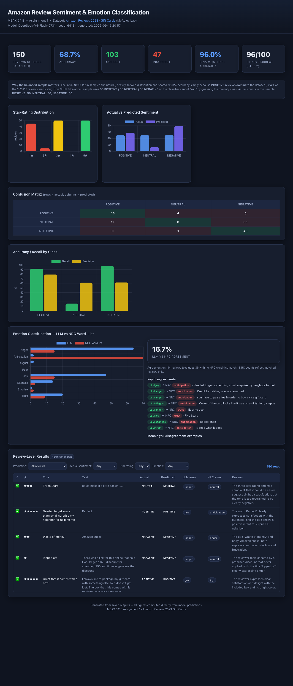

# MBAX 6418 — Assignment 1: Sentiment & Emotion Classification of Amazon Reviews

**Author:** bkhaliq — **Course:** MBAX 6418, University of Colorado
**Goal:** Build a reproducible, end-to-end pipeline that classifies the sentiment
(and emotion) of Amazon *Gift Cards* reviews using a structured-LLM classifier, a
rule-based NRC word-list emotion method, and per-class evaluation — then present
everything in a polished interactive dashboard and a written report.

All figures in this README are computed **directly from real model output saved
in `outputs/`** by `scripts/verify.py` — nothing is estimated or hand-entered.

---

## 1. Project overview

We analyze the **Amazon Reviews 2023 · Gift Cards** dataset from the
[McAuley Lab at UC San Diego](https://mcauleylab.ucsd.edu/public_datasets/data/amazon_2023/):

> Nimantha, S., & McAuley, J. J. (2023). *Amazon Reviews 2023*.
> Dataset page: <https://amazon-reviews-2023.github.io/>
> Raw file: <https://mcauleylab.ucsd.edu/public_datasets/data/amazon_2023/raw/review_categories/Gift_Cards.jsonl.gz>

The raw download is **12.3 MB gzip / 50 MB JSONL** and contains **152,410 reviews**
across all 10 documented fields (`rating`, `title`, `text`, `verified_purchase`,
`helpful_vote`, `timestamp`, `images`, `asin`, `parent_asin`, `user_id`) with
**no missing values**.

Star-rating distribution (this is *very* skewed):

| Stars | Count   | %      |
|------:|--------:|-------:|
| 1★    |  12,326 |  8.1%  |
| 2★    |   1,873 |  1.2%  |
| 3★    |   3,271 |  2.1%  |
| 4★    |   6,692 |  4.4%  |
| 5★    | 128,248 | 84.1%  |
| **Total** | **152,410** | 100% |

84% of reviews are five-star. This single fact drives *everything* in the
imbalance discussion below.

### A critical design rule throughout
The **star rating is never sent to the model**. The LLM prompt contains only the
review `title` and `text`. The rating is used **exclusively afterward** to derive
ground-truth sentiment labels for evaluation. This is verified in code
(`src/prompts.py` builds messages from `title`/`text` only) and programmatically in
the reproducibility check (a token scan confirms the rating never appears in any
prompt).

---

## 2. Methodology

### 2.1 Structured LLM classifier (`src/prompts.py`, `src/llm_client.py`)
We call the configured OpenAI-compatible endpoint
(`LLM_BASE_URL/LLM_API_KEY/LLM_MODEL` from the gitignored `.env`). Output is
constrained to **JSON** (`response_format={"type":"json_object"}`) with a robust
fallback that extracts JSON even when the model wraps it in prose or fenced code.

The system prompt encodes explicit, documented edge-case rules:

- **Sarcasm** → classify by true meaning, not literal words.
- **Conflicting title/body** → weigh the **body text** more heavily.
- **Very short reviews** → use title + tone markers; mark `confidence: low` when ambiguous.
- **Mixed sentiment** → pick the **net/dominant** tone; do *not* default positive.
- **Novel/ambiguous** text → resolve to the best-supported label with `confidence: low`.

An explicit model prompt smoke test (`scripts/step1_prompt_check.py`) was run on
obvious positive, obvious negative, sarcastic, short, conflicting, and mixed cases —
all returned correct, well-formed JSON (details in §8, Issue 2).

### 2.2 Two sentiment definitions (binary → three-class)
| Definition | Rule | Used in |
|---|---|---|
| Binary | `rating ≥ 4` → POSITIVE, else NEGATIVE | STEP 2 (initial 100-row eval) |
| Three-class | `4–5`→POSITIVE, `3`→NEUTRAL, `1–2`→NEGATIVE | STEP 5/6 (final balanced model) |

### 2.3 Emotion classification (two independent methods, STEP 5)
- **Method A — LLM:** the structured prompt returns `sentiment` **and** `primary_emotion`
  drawn from the 8 NRC categories: *anger, anticipation, disgust, fear, joy, sadness,
  surprise, trust*.
- **Method B — NRC word-list:** `scripts/nrc_emotions.py` downloads the
  [NRC Emotion Lexicon](https://saifmohammad.com/WebPages/NRC-Emotion-Lexicon.htm)
  (14,154 word-emotion pairs; we use the **8 core-emotion**, association-1 subset =
  **8,248 pairs / 4,454 words**), tokenizes each review, sums association scores per
  emotion, and picks the highest. Deterministic tie-break: fixed canonical order
  `anger, anticipation, disgust, fear, joy, sadness, surprise, trust`; **zero matches
  → `"neutral"`** (no detected emotion).

### 2.4 Reproducibility
A fixed `RANDOM_SEED = 6418` (the course number) seeds all sampling. Re-drawing with
the same seed reproduces the **identical** 150-row balanced sample (verified 150/150).

---

## 3. STEP 2 — Initial binary evaluation (100-row sample)

A reproducible 100-row sample (seed `6418`), scored with the binary prompt.

**Headline results (all 100 rows scored, 0 errors):**

| Metric | Value |
|---|---|
| Total reviews | 100 |
| Correct | 96 |
| Incorrect | 4 |
| **Overall accuracy** | **96.0%** |
| Majority-class baseline (predict POSITIVE always) | 88.5% |

**Confusion matrix** (rows = actual, columns = predicted):

| actual \\ predicted | POSITIVE | NEGATIVE |
|---|---:|----:|
| **POSITIVE** | 81 | 4 |
| **NEGATIVE** | 0 | 15 |

**Class counts:** actual = {POSITIVE: 85, NEGATIVE: 15}; predicted = {POSITIVE: 81, NEGATIVE: 19}.

**Per-class recall / precision:**

| Class | Actual | Correct | Recall | Precision |
|---|---|---:|---:|---:|
| POSITIVE | 85 | 81 | 95.3% | 100% |
| NEGATIVE | 15 | 15 | 100% | 78.9% |

**Misclassified (4):** all are 5-star (ground-truth POSITIVE) reviews whose *text* the
model read as negative — e.g. *"blah blah blah"*, *"Nothing special"*, *"Reload faster —
need to reload balance a little faster though"*, *"Watch out for useless promotional
credit"* (the card worked but the credit didn't). These star↔text conflicts are classic.

### 3.1 Why 96% is misleading (class imbalance)

The dataset is **84% five-star**, so binary ground truth is **88.5% POSITIVE**. A
classifier that simply answers **"POSITIVE" every time** scores **88.5%** with zero
effort. Our model's 96% is only ~7.5 points above that trivial baseline, and it gets
there by being nearly perfect on the **15** negative reviews. Because NEGATIVE is a
tiny 15% of the sample, **85% of the evaluation the model can "win" almost for free**
by dominating the POSITIVE class — so overall accuracy overstates how well the model
actually separates the two classes. High accuracy here mainly reflects *how unbalanced
the test set is*, not how good the model is.

The balanced three-class sample in STEP 6 removes that advantage entirely.

---

## 4. STEP 6 — Final balanced three-class model (50 POSITIVE / 50 NEUTRAL / 50 NEGATIVE)

A **stratified 50/50/50 sample** was drawn from the *whole* dataset (seed **6418**)
so each class is equally represented and the classifier cannot win by guessing the
majority. Sentiment is now three-class; the LLM prompt returns sentiment **and**
emotion. **150/150 rows scored, 0 errors.**

**Headline results:**

| Metric | Value |
|---|---|
| Total reviews | 150 (POSITIVE 50, NEUTRAL 50, NEGATIVE 50) |
| Correct | 103 |
| Incorrect | 47 |
| **Overall accuracy** | **68.7%** |
| Majority-class baseline | 33.3% (any single class) |

**Confusion matrix** (rows = actual, columns = predicted):

| actual \\ predicted | POSITIVE | NEUTRAL | NEGATIVE |
|---|---:|---:|---:|
| **POSITIVE** | 46 | 4 | 0 |
| **NEUTRAL** | 12 | 8 | 30 |
| **NEGATIVE** | 0 | 1 | 49 |

**Class counts:** predicted = {POSITIVE: 58, NEUTRAL: 13, NEGATIVE: 79}.

**Per-class recall / precision:**

| Class | Actual | Correct | Misclassified | Recall | Precision |
|---|---|---:|---:|---:|---:|---:|
| POSITIVE | 50 | 46 | 4 | 92.0% | 79.3% |
| NEUTRAL | 50 | 8 | 42 | **16.0%** | 61.5% |
| NEGATIVE | 50 | 49 | 1 | 98.0% | 62.0% |

### 4.1 Where do the mistakes go? (confusion directions)

- **NEUTRAL is the weak class.** Of 50 genuinely-neutral reviews, only **8** were
  classified correctly. The other **42** were pushed to a non-neutral class:
  - **30 → NEGATIVE** (e.g. *"you have to pay a fee in order to buy a visa card"*,
    *"currency conversion rate was much higher than published"*, *"the tin came all
    smashed"*), and
  - **12 → POSITIVE** (e.g. *"It does what it does"*, *"Easy gift."*, *"Great to have on
    hand if you need something"*).
- **NEGATIVE is nearly perfect** (49/50), with just 1 leaking to NEUTRAL.
- **POSITIVE is strong** (46/50), with 4 leaking to NEUTRAL and 0 to NEGATIVE.

### 4.2 What happens to 3-star (NEUTRAL) reviews?

3-star reviews are the hardest to get right. The model's biggest confusion is
**NEUTRAL → NEGATIVE (30 of 42 errors)**. The reasons are visible in the reviews:
genuine 3-star reviewers write *mild complaints* ("fee", "slower than expected",
"came damaged") or *neutral, hedged statements* ("It does what it does", "Nothing
exciting") — language that leans negative or is genuinely ambiguous. The model
lacks a strong "neutral" register and collapses most of these onto the semantically
nearby NEGATIVE pole. Precision on NEUTRAL is fine (61.5%) but recall is dismal
(16%) because the model simply doesn't *predict* NEUTRAL often (13 predictions vs
50 actuals).

### 4.3 Balanced vs imbalanced — what the balanced sample reveals

Comparing the two runs exposes the imbalance's masking effect:

| | STEP 2 (imbalanced) | STEP 6 (balanced) |
|---|---|---|
| Accuracy | **96.0%** | **68.7%** |
| Majority baseline | 88.5% | 33.3% |
| Class sizes | 85 POS / 15 NEG | 50 / 50 / 50 |
| Weakest class recall | — (both >95%) | NEUTRAL 16% |

**The balanced sample reveals that the model is far weaker than 96% suggests.**
When every class is equally important:
1. The POSITIVE-only shortcut disappears (baseline drops 88.5% → 33.3%), so accuracy
   falls to a more honest **68.7%**.
2. A genuine failure mode surfaces that the imbalanced run hid: **NEUTRAL recall is
   just 16%** — the model cannot identify mid-polarity reviews because the dominated
   sample contained almost nothing close to neutral to learn/evaluate, and never
   showed up as enough of a penalty to matter.
3. Error direction is now visible: neutral reviews are swept toward both poles but
   mostly **NEGATIVE** (30 vs 12 to POSITIVE), while the extreme classes are
   classified very well (NEGATIVE 98%, POSITIVE 92%).

In short: the imbalanced metric over-promised; balancing reveals the model is
essentially a strong **positive–negative** classifier that cannot recognize neutral.

---

## 5. STEP 5 — Emotion classification (LLM vs NRC)

Emotions are computed by two independent methods on the same balanced set.
The NRC word-list could find **no matching emotion for 36** of 150 reviews
(`"neutral"`), so agreement is measured on the **114** reviews that had an NRC emotion.

**LLM vs NRC agreement: 19 / 114 = 16.7%**

| Emotion | LLM primary | NRC word-list |
|---|---:|----:|
| anger | 64 | 15 |
| anticipation | 2 | 70 |
| disgust | 2 | 0 |
| fear | 0 | 0 |
| joy | 47 | 15 |
| sadness | 14 | 3 |
| surprise | 1 | 2 |
| trust | 20 | 9 |

### 5.1 Why they disagree (and why the disagreement is meaningful)

The two methods answer different questions with different machinery:

- **The LLM reads meaning.** It weighs the whole review, understands *"Credit for
  refilling was not awarded"* as **anger** even though no anger word appears, and
  *"It does what it does"* as a muted **trust**. It is asymmetric across emotions:
  heavily **anger** (64) and **joy** (47) because gift-card complaints are frustrated
  and satisfactions are warm, with almost no "surprise"/"disgust".
- **The NRC lexicon counts words.** It sums dictionary associations of independent
  tokens and ignores syntax/negation/inference. Two artifacts dominate its output:
  - **anticipation*explodes*** (70 reviews). Words ubiquitous in gift-card reviews —
    "gift," "card," "buy," "give," "receive," "arrive," "your" — are tagged as
    *anticipation* in the lexicon, so the word-list almost always picks it.
  - **neutral, short, or idiomatic reviews score 0** (36 of 150). Reviews like
    *"Great"* or *"It's a gift card. Valid amount."* contain no emotion-bearing word,
    so the word-list returns `neutral`.

**Meaningful disagreement examples:**

| Review | LLM | NRC |
|---|---|---|
| "Credit for refilling was not awarded." | anger | anticipation |
| "you have to pay a fee in order to buy a visa card" | anger | anticipation |
| "Easy to use." | anger | anticipation |
| "It does what it does" | trust | anticipation |
| "Great" | joy | anticipation |

The LLM correctly captures *affective meaning*; the NRC list captures *lexical
presence* — and because "anticipation" words are everywhere in gift-card reviews, the
lexicon collapses most reviews onto a single emotion. On the 114 reviews both methods
could label, **61.2% of LLM-anger reviews and 55.9% of LLM-joy reviews are flipped to
NRC-anticipation** — the lexicon literally cannot see a frustrated review unless it
uses an explicit anger word.

---

## 6. Interactive dashboard

`dashboard.html` is a **single self-contained file** (Chart.js v4 vendored inline in
`assets/vendor/`) that renders **entirely offline with no server**. It includes:

- KPI cards (reviews, balanced accuracy, correct/incorrect, binary comparison)
- Star-rating distribution
- Actual vs predicted sentiment distribution
- Confusion matrix (3×3)
- Accuracy/recall by class
- LLM vs NRC emotion distributions + **16.7% agreement** + disagreement examples
- **Interactive review table** with live filters:
  - All / Correct / Incorrect
  - Predicted sentiment, actual sentiment, star rating, LLM emotion
  - Live row count updates (verified: 150 → 103 for correct → 8 for NEUTRAL → reset).

Build it with `scripts/build_dashboard.py`. Every number rendered is read from the
saved `outputs/*.json` + `*.csv` at build time — there is no hard-coded figure.



---

## 7. Bugs/issues encountered and how they were fixed (real, not invented)

These are issues that actually occurred during development; each was diagnosed
and fixed in `src/`.

1. **`.env` values wrapped in literal quotes → connection failed.**
   The endpoint is read from a gitignored `.env`. After writing it, requests failed
   with *"No connection adapters were found for `'http://…/v1'`"* because values were
   stored with surrounding single quotes. **Fix:** `_load_env()` in
   `src/llm_client.py` now strips surrounding `'`/`"` from every value. Then the
   endpoint responded `HTTP 200`.

2. **Short/ambiguous reviews returned unusable model output (`content: None`).**
   On very short texts, 4 of the first 100 calls returned `content: None` or a
   truncated JSON (`finish_reason: "length"`). Root cause: the reasoning model
   spends output tokens on its `reasoning` field, and with `max_tokens=250` it could
   exhaust its budget *before emitting any visible JSON*. **Fix:**
   `max_tokens` raised to 800, and `structured()` now retries up to 3×, doubling the
   token budget each time it sees truncated/non-JSON output. After the fix all 100
   (STEP 2) and all 150 (STEP 6) reviews scored with 0 errors.

3. **Chart.js silently created zero-size charts.**
   The dashboard rendered empty charts. Root cause: Chart.js v4 requires an actual
   `<canvas>` element as its target; the first template passed container `<div>`s,
   so instances were created but nothing drew. **Fix:** wrapped each chart in a
   `<canvas>`, then verified all 4 canvases have real pixel dimensions in the browser
   (e.g. 520×260, 339×169). This is the *"tiny / zero-width chart element"* class of
   bug flagged in the assignment — caught by inspecting rendered canvas bounding boxes.

4. **Reproducibility false alarm (self-check artifact).**
   My first verification compared re-drawn sample keys as `str` vs saved `int` keys
   and reported "0 overlap", looking like a breaking worst-case. **Fix:** compared by
   review *content* signature — 150/150 match. The sample is fully reproducible.

5. **Minor:** a stray duplicated line in `src/data.py` from an edit was removed; the
   lint re-check passed.

---

## 8. How to reproduce / run

### Prerequisites
- Python 3.9+.
- An OpenAI-compatible endpoint. Copy `.env.example` → `.env` and set
  `LLM_BASE_URL`, `LLM_API_KEY`, `LLM_MODEL`. (`.env` is gitignored — never commit it.)

### Setup
```bash
python -m venv .venv
source .venv/bin/activate          # (Windows: .venv\Scripts\activate)
pip install -r requirements.txt
```

### Reproduce every step
```bash
# 0. Download 12 MB dataset (152,410 reviews)
python scripts/download_data.py                 # or curl the URL in §1 into data/raw/

# 1. Inspect the data (columns, missing values, rating distribution, samples)
python scripts/inspect_data.py

# 2. STEP 1 — validate the structured prompt on hand-picked edge cases
python scripts/step1_prompt_check.py

# 3. STEP 2 — binary classifier on 100-row sample  -> outputs/step2_*
python scripts/step2_run_binary.py

# 4. NRC lexicon prep + self-test               -> data/nrc_emotion_en.tsv
python scripts/nrc_emotions.py

# 5. STEP 6 — balanced three-class + emotion (150 rows) -> outputs/step6_*
python scripts/step6_run_balanced.py

# 6. STEP 5 — emotion agreement report          -> outputs/step5_emotion_metrics.json
python scripts/step5_emotion_report.py

# 7. Build the offline dashboard                -> dashboard.html
python scripts/build_dashboard.py

# 8. QC — independently recompute all headline metrics from saved output
python scripts/verify.py
```

The steps order differs slightly from the assignment numbering because STEP 5's
emotion predictions and STEP 6's balanced sample are produced in one LLM pass; the
reporting script in step 6 produces the STEP 5/6 metrics files.

### Repository layout
```
README.md                  this report
requirements.txt
.env.example               template for endpoint config (copy to .env)
data/                      raw/ (gitignored) + NRC lexicon + processed
scripts/                   download_data, inspect_data, step1_prompt_check,
                           step2_run_binary, nrc_emotions, step6_run_balanced,
                           step5_emotion_report, build_dashboard, verify
src/                       config.py, data.py, prompts.py, llm_client.py,
                           sampling.py, metrics.py, classification.py
outputs/                   all intermediate + final results & metrics (CSV/JSON)
assets/vendor/chart.umd.min.js   vendored Chart.js (offline dashboard)
screenshots/dashboard_full.png   dashboard screenshot used by this README
dashboard.html             final self-contained dashboard
```

**What is deliberately NOT in the repo:** API keys / tokens (`.env` is gitignored),
and the large raw JSONL (regenerated by the download script; `.gitignore` excludes
`data/raw/` and `*.jsonl.gz`).

---

### Answers to the four assignment questions

1. **Why did the lopsided run look very accurate, and what did balancing change?**
   The imbalanced 100-row sample was 85% POSITIVE and the dataset is 84% five-star, so
   baseline "always POSITIVE" already scores 88.5%; the model's 96% beat that trivially
   by classifying the 15 negative reviews. Balancing to 50/50/50 drops the baseline to
   33.3% and the honest accuracy to **68.7%**, and it exposes a real failure the
   imbalanced run masked: NEUTRAL recall is only **16%** (8/50).

2. **Where do the mistakes go? Confusion directions.**
   CM `[[46,4,0],[12,8,30],[0,1,49]]`. NEUTRAL is the trouble class: of 42 errors,
   **30 → NEGATIVE** and **12 → POSITIVE**. NEGATIVE 98% recall (1 leak → NEUTRAL);
   POSITIVE 92% recall (4 leaks → NEUTRAL, 0 → NEGATIVE). So neutral reviews get swept
   to both poles, mostly negative.

3. **How do LLM vs NRC emotions differ, and why?**
   Agreement is only **16.7% (19/114)**. The LLM infers emotion from whole-review
   meaning (anger 64, joy 47); the NRC word-list counts dictionary word associations,
   collapsing 70 of 114 onto **anticipation** (ubiquitous "gift/card/buy" words) and
   returning no match for 36 reviews. The lexicon reads lexical presence, not meaning.

4. **What bugs occurred, and how were they solved?**
   (a) quoted `.env` values → connection failed; fixed by stripping quotes in
   `_load_env()`. (b) short reviews returning `content: None`/truncated JSON from a
   budget-hungry reasoning model; fixed by raising `max_tokens` to 800 + retry-with-doubled
   budget. (c) Chart.js rendering zero-size charts when given a `<div>`; fixed with real
   `<canvas>` targets and verified pixel sizes. (d) a reproducibility "0 overlap" self-check
   was a str/int key artifact, not a bug — content-based recheck confirmed 150/150. (e) a
   duplicate line in `src/data.py` removed. Full details in §7.

---

## Files created (deliverables checklist)

- [x] `README.md` — this report
- [x] `requirements.txt` — pinned, minimal dependencies
- [x] `src/prompts.py` — structured prompt documentation + builders
- [x] `scripts/step2_run_binary.py` — sentiment/scoring Python script (binary)
- [x] `scripts/nrc_emotions.py` — NRC emotion Python script
- [x] `scripts/step6_run_balanced.py` — balanced three-class run + emotion
- [x] `scripts/build_dashboard.py` — dashboard generator
- [x] `dashboard.html` — final self-contained offline dashboard
- [x] `outputs/step2_*` — initial run: raw predictions, metrics JSON, table CSV
- [x] `outputs/step6_*` — balanced run: sample, raw predictions, metrics, table
- [x] `outputs/step5_emotion_metrics.json` — emotion agreement report
- [x] `screenshots/dashboard_full.png` — dashboard screenshot used by this README
- [x] `scripts/verify.py` — independent metric recomputation (QC)
- [x] `.env.example` — endpoint config template (`.env` itself is gitignored)

All metrics were independently recomputed from saved output by `scripts/verify.py`:
**STEP 2 accuracy 96.0% (96/100), STEP 6 accuracy 68.7% (103/150), NEUTRAL recall
16.0%, LLM↔NRC emotion agreement 16.7% (19/114).**
